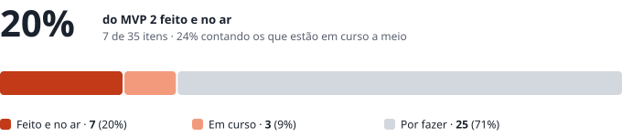
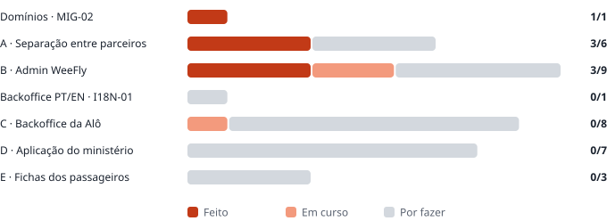

# WeeFly · MVP 2 · Estado a 30 de setembro

| | |
|---|---|
| **Para** | Dominik · Ivandro |
| **De** | Fábio |
| **Data** | 30 de setembro de 2026 |
| **Base** | `WeeFly_MVP2_Para_Developer.md` (30 de setembro) · 35 itens em 5 blocos |
| **No ar** | `concierge.weefly.africa` · commit `06c4b44` · migração `0026` aplicada |

---

## Onde estamos

**A primeira entrega para testar está no ar**: os passos 0 a 3 da *Sequência*. É o que dá acesso Admin à equipa WeeFly e o que desbloqueia as contas da Alô.

Em esforço, o número real é mais baixo do que os 20%. Os três blocos mais pesados ainda não começaram: a bolsa do ministério (`PAR-03`), a aplicação do ministério (`MIN-01`) e a marca em todos os ecrãs e emails (`TEN-02`).

### Por bloco

| Bloco | Feito | Em curso | Por fazer | Total |
|---|---|---|---|---|
| Domínios · `MIG-02` | 1 | 0 | 0 | 1 |
| A · Separação entre parceiros | 3 | 0 | 3 | 6 |
| B · Admin WeeFly | 3 | 2 | 4 | 9 |
| Backoffice PT/EN · `I18N-01` | 0 | 0 | 1 | 1 |
| C · Backoffice da Alô | 0 | 1 | 7 | 8 |
| D · Aplicação do ministério | 0 | 0 | 7 | 7 |
| E · Fichas dos passageiros | 0 | 0 | 3 | 3 |
| **Total** | **7** | **3** | **25** | **35** |

---

## O que está feito e no ar

| ID | O que faz |
|---|---|
| `MIG-02` | Todos os links saem do endereço configurado, e nunca do endereço por onde se abriu o back-office. O servidor só responde a `concierge.weefly.africa`. O ficheiro para desligar o `weefly.duckdns.org` no NGINX está pronto. |
| `TEN-01` | Parceiro → organização → caso. Todos os casos têm parceiro; a organização é opcional. |
| `TEN-03` | O back-office lê pela sessão de quem está ligado, e é a base de dados que decide o que cada conta vê. Um caso de outro parceiro aberto pelo endereço directo dá **não encontrado**. Fila, pesquisa, campainha, clientes e seletor de vendedor respeitam a mesma fronteira. |
| `TEN-06` | Cada conta pertence a um parceiro, que vem da sessão. As permissões vêm do perfil guardado nos dados. O Admin aparece a qualquer conta com o perfil *Admin WeeFly*, e não só à do Dominik. O login abre o Concierge. |
| `ADM-01` | *Admin › Parceiros*: criar um parceiro (cria o primeiro administrador e envia o convite), configurar os dados e a marca, suspender sem apagar. A suspensão bloqueia o login e congela os links. |
| `ADM-02` | *Admin › Utilizadores e permissões*, e *Agente › Equipa* para o Admin do parceiro. Os cinco perfis fixos. Criar, editar, suspender e reactivar; nada se apaga. Suspender termina as sessões abertas. Cada alteração fica registada com autor, data, antes e depois. Um Admin do parceiro não consegue dar o perfil Admin WeeFly — recusado pela base de dados, não só pelo ecrã. |
| `ADM-09` | O Admilson (`admilsonborges@bonako.com`) tem o perfil Admin WeeFly. |

### Em curso

| ID | O que falta |
|---|---|
| `ADM-05` | Os módulos futuros já aparecem bloqueados com *Brevemente* (vem do `PRO-03`/`PRO-04`). Falta confirmar no teste. |
| `ADM-07` | O campo da comissão já existe no caso, vazio. Nada é calculado até às decisões C1, D1, D7 e D8. |
| `PAR-01` | O login já abre no Concierge. Falta confirmar com uma conta real da Alô. |

### Provado antes do deploy

- A migração `0026` correu num Postgres de teste, duas vezes seguidas, com as 25 anteriores.
- Os testes de isolamento correm como o Supabase corre: uma conta por parceiro, cada tabela, leitura e escrita. Incluem o B4 (o Admin do parceiro não dá Admin WeeFly), o B5 (suspender corta no pedido seguinte) e o B6 (o registo).
- Uma revisão independente do código à procura de fugas entre parceiros encontrou três pontos, corrigidos antes do deploy.

---

## Para fechar a primeira entrega

| # | O quê | Quem |
|---|---|---|
| 1 | Correr os testes do **Bloco A** (A1–A9) e do **Bloco B** (B1–B6). *"Se um falhar, nenhuma conta real da Alô é aberta."* Os passos estão em `docs/mvp2-entrega-1.md`. | Admilson · Dominik |
| 2 | Enviar o convite ao Admilson: *Admin › Utilizadores e permissões* › *Reenviar convite*. | Dominik ou Fábio |
| 3 | Instalar `deploy/nginx/weefly-duckdns-off.conf` e desligar o actualizador do DuckDNS. O endereço antigo tem de deixar de responder. | Fábio |
| 4 | Fechar a porta 22 do servidor. Está aberta a toda a internet; o acesso já é feito pelo Session Manager. | Sarin |

O A10 (`alo.weefly.africa/m/nao-existe`) e o A6 (exportar) ainda não se podem testar: o primeiro depende do DNS (`TEN-04`), o segundo do `ADM-03`.

---

## Decisões que são precisas

Por ordem de urgência: as primeiras travam o trabalho das próximas semanas.

| # | Pergunta | Quem decide | Bloqueia | Precisa-se até |
|---|---|---|---|---|
| **S1** | Aprovar a alteração ao âmbito: o `ADM-02` e o `ADM-08` entram no MVP 2. O `ADM-02` já está feito. | Ivandro · Dominik | Datas do MVP 2 | Já |
| **O3** | A gestão de ministérios fica dentro de **Cliente** ou num menu próprio **Ministérios**? | Ivandro | `PAR-02` (passo 5) | Antes do passo 5 |
| **O4** | A secretária entra **só pelo link**, ou com **link e password**? | Ivandro | `MIN-01` (passo 6) | Antes do passo 6 |
| **O1** | Quem, na Alô e na WeeFly, recebe os alertas de saldo? | Alô · Dominik | `PAR-05` · `ADM-06` | Antes do passo 5 |
| **O2** | O ministério vê o seu próprio saldo, ou só a Alô? | Dominik · Alô | `PAR-03` | Antes do passo 5 |
| **D9** | Quando um viajante não voa, o que acontece ao valor já descontado da bolsa? Até lá: crédito manual com motivo. | Contrato com a Alô | `PAR-03` | Antes do lançamento |
| **C1** | As comissões calculam-se no sistema (v5.2) ou fora dele (decisão de 26 de setembro)? | Ivandro · Dominik | `ADM-07` · `PAR-08` | Antes do passo 7 |
| **D1** | A percentagem por emissão é sobre o custo ou sobre o valor cobrado ao ministério? | Dominik (com a Alô) | `ADM-07` | Antes do passo 8 |
| **D7** | A taxa por conta cobra-se uma vez ou todos os meses? | Dominik | `ADM-07` | Antes do passo 8 |
| **D8** | A comissão é diferente entre revendedor oficial e white label? | Dominik | `ADM-07` | Antes do passo 8 |
| **L1** | Base legal para guardar passaportes e contactos de funcionários do Estado. | Jurídico | `DAT-03` | Antes do lançamento |
| **L2** | Prazo de conservação desses dados. | Jurídico | `DAT-03` | Antes do lançamento |
| **L3** | Os dados têm de estar alojados em Cabo Verde? O servidor está na Irlanda (AWS). | Jurídico | Infraestrutura | **O mais cedo possível** — se a resposta for sim, muda onde tudo corre |
| **L-03** | Neerlandês: falta o texto para "sem bagagem". | Dominik | Dicionário NL | Quando der |

---

## O que é preciso pedir

### À Alô — para configurar o parceiro (`ADM-01`, `TEN-02`, `MIN-04`)

| Dado | Estado |
|---|---|
| Nome comercial | ✅ Alô Cabo Verde Tour |
| Logótipo PNG | ✅ Recebido |
| Cores principal e de destaque | ✅ Do logótipo |
| **Logótipo em vetor** (SVG ou PDF) | ❌ O PNG tem as margens serrilhadas |
| **Versão compacta** do logótipo (só o globo) | ❌ Para telemóvel, ícone da app e favicon |
| Cor escura — confirmar `#0078E8` | ❌ |
| Nome legal, NIF, morada | ❌ |
| Pessoa de contacto, email, telefone | ❌ |
| Nome e endereço do remetente dos emails (ex.: `reservas@…`) | ❌ |
| Endereço de resposta | ❌ |
| Texto do rodapé | ❌ |
| Número de WhatsApp de apoio | ❌ |
| O link mostra o ecrã da Alô ou o ecrã WeeFly? | ❌ Presume-se o da Alô |
| Data de início do contrato | ❌ |
| **O email do primeiro administrador da Alô** | ❌ É quem recebe o convite quando se criar o parceiro |

### Para os testes — um ministério de teste

Nome, identificador no endereço (ex.: `teste`), brasão, nome e contactos da secretária de teste, saldo inicial e limite de alerta.

### Ao Sarin — infraestrutura

| Pedido | Para quê |
|---|---|
| Registo DNS `*.weefly.africa` a apontar para o servidor | `TEN-04` · `alo.weefly.africa` |
| Certificado **wildcard** para `*.weefly.africa` | `TEN-04` · um certificado para todos os parceiros |
| Fechar a porta 22 | Segurança · o acesso já é pelo Session Manager |

### Ao Resend (Fábio)

Verificar o domínio de envio da Alô quando ela disser qual é. Sem isso, os emails da Alô não podem sair com o remetente dela (`TEN-02`).

---

## Próximos passos

| Passo | Itens | Depende de |
|---|---|---|
| **4** | `TEN-02` marca · `TEN-04` endereços · `TEN-05` Powered by WeeFly · `I18N-01` backoffice PT/EN | DNS e certificado (Sarin) · dados da Alô |
| **5** | `PAR-01` a `PAR-05` · `ADM-08` espaço B2G · `ADM-06` | O3 · O1 · O2 |
| **6** | `MIN-01` a `MIN-07` · a aplicação do ministério | O4 · ministério de teste |
| **7** | `PAR-06` a `PAR-08` · cotação, pagamento externo, finanças | C1 |
| **8** | `ADM-03`, `ADM-04`, `ADM-07` · números e receita | D1 · D7 · D8 |
| **9** | `DAT-01` a `DAT-03` · fichas dos passageiros | L1 · L2 · L3 |

### O que avança já, sem esperar

Tudo o que é da plataforma e não depende de uma decisão ou de um dado externo começa agora, pela ordem da *Sequência*. As decisões encaixam depois, sem refazer o trabalho.

| Item | Como avança sem a decisão |
|---|---|
| `TEN-02` · `TEN-05` · `I18N-01` | Por inteiro. A marca lê o que estiver preenchido no parceiro; os dados da Alô que faltam entram pelo ecrã, sem código. |
| `TEN-04` | O encaminhamento por subdomínio fica construído e testado; liga-se no dia em que o DNS e o certificado existirem. |
| `PAR-02` | Construído num menu próprio. Se o **O3** disser *dentro de Cliente*, muda só o sítio do menu. |
| `PAR-03` · `PAR-04` | Por inteiro: saldo, movimentos, desconto na emissão, bloqueio. O **O2** é um interruptor (a secretária vê ou não o saldo), e o **D9** fica como crédito manual com motivo, como o documento pede. |
| `PAR-05` · `ADM-06` | O motor dos alertas e o ecrã dos destinatários. O **O1** é só preencher quem recebe. |
| `ADM-08` · `ADM-04` · `ADM-03` | Por inteiro, só de leitura. |
| `MIN-01` a `MIN-07` | A aplicação inteira. A entrada da secretária (**O4**) fica por ligar: o resto não depende dela. |
| `PAR-06` · `PAR-07` · `PAR-08` | Por inteiro, sem a coluna da comissão (**C1**). |
| `DAT-01` · `DAT-02` | Por inteiro. |

**Fica parado até haver resposta:** o cálculo da comissão (`ADM-07`, e a comissão no `PAR-08`) e a conservação dos dados (`DAT-03`). E nenhum link é enviado a um ministério real antes de L1, L2 e L3.
