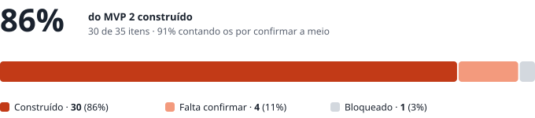
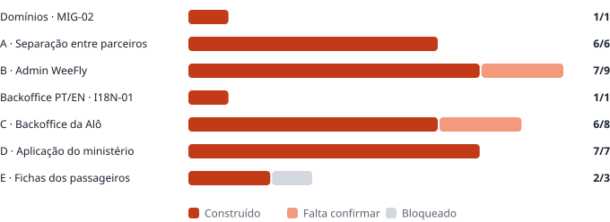

# WeeFly · MVP 2 · Estado ao fim de 30 de setembro

| | |
|---|---|
| **Para** | Dominik · Ivandro · Admilson |
| **De** | Fábio |
| **Data** | 30 de setembro de 2026, fim do dia |
| **Base** | `WeeFly_MVP2_Para_Developer.md` (30 de setembro) · 35 itens em 5 blocos |
| **Código** | `main` · commit `f0aac44` · migrações `0026` a `0030` aplicadas |
| **No ar** | `concierge.weefly.africa` corre ainda o `06c4b44` (a primeira entrega). O deploy do `f0aac44` está por fazer |

Substitui o estado da manhã do mesmo dia.

---

## Onde estamos

**Tudo o que não depende de uma decisão está construído**: os passos 0 a 9 da *Sequência*, com excepção de duas coisas que o próprio documento manda esperar — o cálculo da comissão (`ADM-07`) e a conservação dos dados (`DAT-03`).

"Construído" quer dizer: o código está no `main`, compila, e a base de dados tem as tabelas. **Ainda não quer dizer testado de ponta a ponta nem no ar.** Os testes dos Blocos A, B e D estão por correr, e o deploy também (ver *Para pôr no ar*).

### Por bloco

| Bloco | Construído | Falta confirmar | Bloqueado | Total |
|---|---|---|---|---|
| Domínios · `MIG-02` | 1 | 0 | 0 | 1 |
| A · Separação entre parceiros | 6 | 0 | 0 | 6 |
| B · Admin WeeFly | 7 | 2 | 0 | 9 |
| Backoffice PT/EN · `I18N-01` | 1 | 0 | 0 | 1 |
| C · Backoffice da Alô | 6 | 2 | 0 | 8 |
| D · Aplicação do ministério | 7 | 0 | 0 | 7 |
| E · Fichas dos passageiros | 2 | 0 | 1 | 3 |
| **Total** | **30** | **4** | **1** | **35** |

**Falta confirmar:**

- `ADM-05` (módulos futuros com *Brevemente*): vem do `PRO-03`/`PRO-04`, falta ver no teste.
- `ADM-07`: os campos estão no caso e aparecem nos números, mas o cálculo espera pelo C1.
- `PAR-01` (abre no Concierge): falta uma conta real da Alô.
- `PAR-06` (cotação e oferta): é o motor que já existe, com o caso no parceiro certo; falta um caso real da Alô.

**Bloqueado:** `DAT-03`, até haver resposta a L1, L2 e L3.

---

## O que ficou construído desde a primeira entrega

### Passo 4 · marca, endereços e duas línguas (`6721b4d`)

| ID | O que faz |
|---|---|
| `TEN-02` | A marca do parceiro — logótipo, brasão do ministério, cores, remetente, resposta e rodapé — no `/pc` e nos emails ao cliente. Nenhuma cor escrita no código: a WeeFly também é um parceiro, com as cores dela nos dados (`0027`). |
| `TEN-04` | O parceiro pelo subdomínio (`alo.weefly.africa`), pronto para o DNS. Um subdomínio desconhecido dá 404. |
| `TEN-05` | *Powered by WeeFly* no backoffice do parceiro e no Admin. |
| `I18N-01` | Backoffice em português e inglês, escolhido nas *Definições* e guardado na conta. O que vai para o cliente continua na língua do caso. |

### Passo 5 · backoffice da Alô e a bolsa (`5d6e45a`)

| ID | O que faz |
|---|---|
| `PAR-02` | *Agente › Ministérios*: criar, editar, o link único do ministério, que se regenera. |
| `PAR-03` | A bolsa é a soma de movimentos que só se acrescentam. Crédito com a referência do documento. O débito bloqueia a linha e recusa sem saldo — dois agentes ao mesmo tempo não passam os dois. |
| `PAR-04` | Troca de secretária: a conta antiga é suspensa e sai um link novo. |
| `PAR-05` · `ADM-06` | Alertas de saldo uma vez por dia, por email e WhatsApp, aos destinatários configurados. |
| `PAR-07` | *Confirmar pagamento externo* na ficha do caso: regista, desconta da bolsa e liberta a emissão. Reverter repõe o saldo. |
| `ADM-08` | *Admin › B2G*: todos os ministérios de todos os parceiros, só leitura; corrigir o saldo pede motivo e fica registado. |

### Passo 6 · a aplicação do ministério

| ID | O que faz |
|---|---|
| `MIN-01` | `/m/<ministério>/<link>`: barra inferior fixa com *Novo pedido* (abre primeiro) e *Minhas passagens* (a viagem activa em cima, o arquivo por baixo, só desse ministério). A barra continua nos ecrãs do caso. Quem pede já é conhecido: o passo do contacto salta-se. |
| `MIN-02` | Logótipo da Alô e brasão do ministério no cabeçalho. |
| `MIN-03` | Telefone e email por passageiro, marcados *só para apoio operacional* com a frase a explicar porquê (`0029`). Aviso de passaporte a menos de seis meses do regresso. Escrever um nome que já viajou com o ministério oferece reutilizar a ficha. |
| `MIN-04` | O WhatsApp da Alô, com o nome do ministério e a referência já escritos, em todos os ecrãs. |
| `MIN-05` | Email de boas-vindas com a marca da Alô, o link e as instruções por plataforma (do passo 5). |
| `MIN-06` | Instalar como aplicação: manifesto por ministério, Android num toque, iPhone em três passos. |
| `MIN-07` | A oferta mostra o prazo desde o envio. Num ministério não há ecrã de pagamento: a secretária lê que não há nada a pagar do lado dela. O caso aparece à Alô como *Pronto a emitir*. Se o saldo não cobrir, a secretária vê-o e a Alô é avisada na campainha. |

> **Porque é que aceitar não emite sozinho.** O `PAR-07` diz que é *confirmar o pagamento externo* que desconta da bolsa e liberta a emissão, e a `0028` foi construída assim. Por isso, depois de a secretária aceitar, o caso fica na fila da Alô com o alerta *Pronto a emitir · confirmar o pagamento externo*. É um clique do agente, sem nada pedido à secretária. Se quiserem que o débito aconteça sozinho no momento em que a secretária aceita, é uma mudança pequena — mas é uma decisão, não um pormenor.

### Passos 7 a 9 · finanças, números, casos e fichas

| ID | O que faz |
|---|---|
| `PAR-08` | *Agente › Finanças*, para o Admin do parceiro. Por passagem: custo, valor cobrado, comissão, data de emissão e quem emitiu. Por ministério: emitido, consumido da bolsa e saldo. Exportação para CSV. |
| `ADM-03` | *Admin › Números*: passagens por parceiro e por ministério, custo unitário e total, a linha temporal, quem emitiu. Filtros: hoje, semana, mês, ano, intervalo, e por parceiro. CSV. **É a mesma leitura que a do `PAR-08`** — os números batem por construção, não por coincidência. |
| `ADM-07` | A coluna da comissão está no caso e aparece no `PAR-08`, no `ADM-03` e no CSV — vazia. Nada é calculado. |
| `ADM-04` | *Admin › Casos*: parceiro, depois ministério, depois o caso, em leitura. Para mexer num caso de outro parceiro há *Intervir*: pede um motivo, dá quatro horas, e fica registado duas vezes — na tabela das intervenções (só o Admin a vê) e no histórico do caso, que o parceiro vê. Enquanto dura, a ficha mostra uma faixa com *Terminar intervenção*. |
| `DAT-01` | As fichas pertencem ao ministério. Nascem quando a secretária grava os passageiros; a `0030` criou-as também para os casos que já existiam. Editáveis no backoffice da Alô, com o histórico de cada alteração — quem, quando, de onde, antes e depois. O histórico é escrito pela base de dados e não se altera. |
| `DAT-02` | Um passaporte guardado a menos de seis meses de expirar: email à secretária, uma vez por validade, no mesmo cron diário dos alertas de saldo. No backoffice a ficha fica marcada ⚠, e o ministério mostra quantas há. |

### Base de dados

As migrações `0026` a `0030` estão aplicadas. Confirmado com `node scripts/check-migrations.mjs`: *Tudo aplicado*.

Os testes de isolamento entre parceiros existem para cada bloco: `test_tenancy`, `test_rbac`, `test_b2g` e, novo, `test_travellers`. Este último testa o histórico, que não se altera, o passaporte único, as fichas que a Beta não vê e as intervenções que só o Admin lê. **Correram todos**, num Postgres de teste com as 30 migrações aplicadas duas vezes seguidas (`bash supabase/tests/run.sh`): tudo OK.

---

## Para pôr no ar

| # | O quê | Quem |
|---|---|---|
| 1 | Deploy do `f0aac44` no EC2 (`git pull`, build, reiniciar), como em `docs/deploy-ec2.md`. | Fábio · Sarin |
| 2 | Confirmar que o `PC_CRON_TOKEN` está no ambiente e ligar o timer: `sudo cp deploy/systemd/weefly-b2g-alerts.* /etc/systemd/system/` e `sudo systemctl enable --now weefly-b2g-alerts.timer`. Sem ele, os alertas de saldo e de passaporte não saem. | Sarin |
| 3 | Instalar `deploy/nginx/weefly-duckdns-off.conf` e desligar o actualizador do DuckDNS (da primeira entrega, ainda por fazer). | Fábio |
| 4 | Fechar a porta 22. | Sarin |

---

## Testes a correr

*"Se um falhar, nenhuma conta real da Alô é aberta."*

| Bloco | Onde | O que prova |
|---|---|---|
| **A** (A1–A10) · **B** (B1–B6) | `docs/mvp2-entrega-1.md` | Separação entre parceiros, perfis, Admin WeeFly. O A6 (exportar) já se pode testar: é o CSV do `ADM-03`. O A10 continua a depender do DNS. |
| **D** (D1–D8) | Documento do Admilson, *Teste do Bloco D* | Do pedido da secretária à passagem emitida, com o *Ministério de Teste*. No D3, "segue para a emissão" é o agente confirmar o pagamento externo (ver a nota do `MIN-07`). |
| Finanças | *Agente › Finanças* e *Admin › Números* | Emitir duas passagens de teste, uma de um ministério. Os valores do parceiro e do Admin têm de ser iguais, e o CSV igual ao ecrã. |
| Intervenção | *Admin › Casos* | Abrir um caso da Alô com uma conta Admin WeeFly: só leitura. *Intervir* com motivo: abre no Concierge, e o motivo aparece no histórico do caso para a Alô. |
| Fichas | *Agente › Ministérios › ministério* | Um passageiro com passaporte a expirar daqui a 4 meses: ⚠ na lista; editar a ficha: a alteração aparece no histórico. |

---

## Decisões que são precisas

| # | Pergunta | Quem decide | Como está construído enquanto não há resposta |
|---|---|---|---|
| **C1** | As comissões calculam-se no sistema ou fora dele? | Ivandro · Dominik | Coluna vazia em todo o lado. |
| **D1** | A percentagem é sobre o custo ou sobre o valor cobrado? | Dominik (com a Alô) | — |
| **D7** | A taxa por conta é única ou mensal? | Dominik | — |
| **D8** | Comissão diferente entre revendedor e white label? | Dominik | — |
| **L1** · **L2** | Base legal e prazo de conservação dos passaportes e contactos. | Jurídico | Nada se apaga nem se anonimiza. **Nenhum link vai a um ministério real antes disto.** |
| **L3** | Os dados têm de estar em Cabo Verde? O servidor está na Irlanda. | Jurídico | **O mais cedo possível** — se for sim, muda onde tudo corre. |
| **O4** | A secretária entra só pelo link, ou com link e password? | Ivandro | Só pelo link. A password acrescenta-se num sítio só, sem mexer no resto. |
| **O3** | Ministérios dentro de *Cliente* ou num menu próprio? | Ivandro | Menu próprio. Mudar é mudar o menu. |
| **O1** | Quem recebe os alertas de saldo? | Alô · Dominik | Ninguém até ser preenchido no ecrã dos destinatários. O alerta fica registado. |
| **O2** | O ministério vê o seu saldo? | Dominik · Alô | Não, por omissão. É um interruptor por ministério. |
| **D9** | O viajante que não voa: o que acontece ao valor descontado? | Contrato com a Alô | Crédito manual com motivo. |
| **MIN-07** | Aceitar a oferta desconta da bolsa sozinho, ou fica o clique do agente? | Ivandro · Dominik | O clique do agente (ver a nota acima). |
| **S1** | Aprovar o `ADM-02` e o `ADM-08` no âmbito do MVP 2. | Ivandro · Dominik | Os dois estão feitos. |

---

## O que é preciso pedir

**À Alô:** logótipo em vetor e a versão compacta (ícone da app instalada e favicon), a cor escura, nome legal, NIF e morada, a pessoa de contacto, o remetente e o endereço de resposta dos emails, o texto do rodapé, o **número de WhatsApp de apoio**, a data de início, e o **email do primeiro administrador**.

**Para os testes:** o *Ministério de Teste* — nome, identificador no endereço, brasão, a secretária de teste com contactos, saldo inicial e limite de alerta.

**Ao Sarin:** DNS `*.weefly.africa` e certificado wildcard (`TEN-04`), o timer dos alertas e a porta 22.

**Ao Resend (Fábio):** verificar o domínio de envio da Alô assim que ela disser qual é.

---

## Próximos passos

1. Deploy do `f0aac44` e o timer dos alertas.
2. Testes dos Blocos A, B e D, e os das finanças, da intervenção e das fichas.
3. Com as respostas: C1, D1, D7 e D8 ligam o cálculo da comissão (`ADM-07`, e a coluna no `PAR-08`/`ADM-03`); L1 a L3 fecham o `DAT-03`; o O4 fecha a entrada da secretária.
