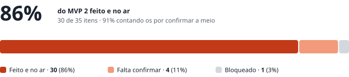
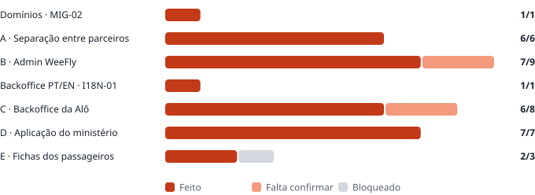

# WeeFly · MVP 2 · Quanto está feito e o que falta para os 100%

| | |
|---|---|
| **Para** | Dominik · Ivandro · Admilson |
| **De** | Fábio |
| **Data** | 30 de setembro de 2026, 22:45 |
| **Base** | `WeeFly_MVP2_Para_Developer.md` · 35 itens em 5 blocos |
| **No ar** | `concierge.weefly.africa` · código `f0aac44` · migrações `0026` a `0030` aplicadas · alertas diários ligados |

---

## Em três números

| | % | O que conta |
|---|---|---|
| **Feito e no ar** | **86%** | 30 dos 35 itens construídos, no servidor, sem nada por fazer |
| **Sem código por escrever** | **94%** | 33 dos 35: aos 30 somam-se três que só esperam por um teste com dados reais da Alô |
| **Testes de fecho passados** | **0%** | 0 dos 5 testes que o documento exige para fechar o MVP 2. Estão prontos para correr |

Os 100% do MVP 2 não são só código. O próprio documento define o fecho por testes (*Como fechar o MVP 2*), e nenhum foi ainda corrido por quem aceita: Admilson, Dominik e a Alô. Os testes automáticos da base de dados — isolamento entre parceiros, perfis, bolsa, fichas — **passam todos**. Esses são nossos; os de aceitação são vossos.

### Por bloco

| Bloco | Feito e no ar | Falta confirmar | Bloqueado | Total | % feito |
|---|---|---|---|---|---|
| Domínios · `MIG-02` | 1 | 0 | 0 | 1 | 100% |
| A · Separação entre parceiros | 6 | 0 | 0 | 6 | 100% |
| B · Admin WeeFly | 7 | 2 | 0 | 9 | 78% |
| Backoffice PT/EN · `I18N-01` | 1 | 0 | 0 | 1 | 100% |
| C · Backoffice da Alô | 6 | 2 | 0 | 8 | 75% |
| D · Aplicação do ministério | 7 | 0 | 0 | 7 | 100% |
| E · Fichas dos passageiros | 2 | 0 | 1 | 3 | 67% |
| **Total** | **30** | **4** | **1** | **35** | **86%** |

---

## Os 5 itens que faltam

| Item | O que falta | Porque não está feito | Quem desbloqueia | Código depois disso |
|---|---|---|---|---|
| `ADM-05` · módulos futuros bloqueados | Ver no teste que Fornecedor, experiências, carros e alojamento aparecem com *Brevemente* e não abrem | Já vem do `PRO-03`/`PRO-04`. Falta só a confirmação | Admilson, no teste do Bloco B | Nenhum |
| `PAR-01` · abre no Concierge | Entrar com uma conta real da Alô e cair no Concierge | Não há ainda conta da Alô: falta o **email do primeiro administrador** | Alô | Nenhum |
| `PAR-06` · cotação e oferta | Uma cotação real feita pela Alô, enviada a um ministério de teste | É o motor que já existe; o caso já fica no parceiro certo. Falta a prova com a Alô | Alô · ministério de teste | Nenhum |
| `ADM-07` · modelo de receita | Calcular a comissão na emissão e guardá-la no caso | Os campos estão no caso e aparecem nos números e no CSV, vazios. **O documento manda não calcular nada até haver decisão** | Dominik · Ivandro: **C1, D1, D7, D8** | Pequeno: a taxa por parceiro e o cálculo na emissão |
| `DAT-03` · conservação e base legal | Prazo de conservação, anonimização automática no fim do prazo, texto de consentimento no ecrã da secretária, exportação e apagamento a pedido | **O documento manda esperar pelo jurídico** | Jurídico: **L1, L2, L3** | Médio. O L3 pode mudar onde o servidor corre |

---

## Os testes que fecham o MVP 2

Do documento, secção *Como fechar o MVP 2*. Cada linha é uma porta: se falhar, o passo seguinte não avança.

| # | Teste | Pronto para correr? | Se falhar |
|---|---|---|---|
| 1 | **Bloco A** (isolamento entre parceiros) · **Bloco B, B1–B6** (Admin e permissões) | Sim. O A10 (`alo.weefly.africa/m/nao-existe`) espera pelo DNS wildcard | Nenhuma conta real da Alô é aberta |
| 2 | **Bloco B, B7–B10** (espaço B2G) | Sim | Os testes finais de vendas não começam |
| 3 | **Bloco C** (ministério, bolsa, alertas) | Sim, com o ministério de teste. Os alertas saem às 08:00 de Cabo Verde, e só para quem estiver nos destinatários (O1) | A aplicação do ministério não avança |
| 4 | **Bloco D, D1–D8** (do pedido da secretária à passagem emitida) | Sim, com o ministério de teste. O D8 (ícone no ecrã inicial) fica com o logótipo que houver até chegar a versão compacta | Não se envia nenhum link a um ministério real |
| 5 | **Lançamento**: L1, L2, L3 respondidas e `DAT-03` feito | Não. Espera pelo jurídico | Não se guardam passaportes de ministérios reais |

Junto dos testes do documento, há mais três que valem a pena, do que se construiu hoje:

- **Finanças:** duas passagens de teste, uma delas de um ministério. *Agente › Finanças* e *Admin › Números* têm de dar os mesmos valores, e o CSV tem de ser igual ao ecrã.
- **Intervenção:** um Admin WeeFly abre um caso da Alô. Começa em leitura; ao *Intervir*, o motivo tem de ficar no histórico do caso.
- **Fichas:** um passaporte a expirar em 4 meses aparece com ⚠, e uma edição da ficha fica no histórico.

---

## Tudo o que falta, por quem

### Decisões

| # | Pergunta | Quem | Trava | Como está hoje |
|---|---|---|---|---|
| **C1** | Comissões no sistema ou fora? | Ivandro · Dominik | `ADM-07` | Coluna vazia |
| **D1** | Percentagem sobre o custo ou sobre o valor cobrado? | Dominik (com a Alô) | `ADM-07` | — |
| **D7** | A taxa por conta é única ou mensal? | Dominik | `ADM-07` | — |
| **D8** | Comissão diferente entre revendedor e white label? | Dominik | `ADM-07` | — |
| **L1** · **L2** · **L3** | Base legal, prazo, alojamento em Cabo Verde | Jurídico | `DAT-03` · lançamento | Nada se apaga; nenhum link a um ministério real |
| **O4** | A secretária entra só pelo link, ou com password? | Ivandro | — | Só pelo link. Uma password é uma mudança pequena, num sítio só |
| **MIN-07** | Aceitar a oferta desconta da bolsa sozinho, ou fica o clique do agente? | Ivandro · Dominik | — | O clique do agente, como o `PAR-07` descreve |
| **S1** | Aprovar o `ADM-02` e o `ADM-08` no âmbito | Ivandro · Dominik | — | Os dois já estão feitos |
| O1 · O2 · O3 · D9 | Destinatários dos alertas · saldo visível ao ministério · menu dos ministérios · viajante que não voa | Alô · Dominik · Ivandro | — | Construídos com o valor provisório do documento. Mudar é configuração |
| L-03 | Neerlandês: "sem bagagem" | Dominik | — | Só o dicionário |

### Dados da Alô

Email do **primeiro administrador** (é o que abre o `PAR-01`), logótipo em vetor e a **versão compacta** (ícone da app e favicon), cor escura, nome legal, NIF e morada, pessoa de contacto, remetente e resposta dos emails, rodapé, **número de WhatsApp de apoio**, data de início.

E um **ministério de teste**: nome, identificador no endereço, brasão, a secretária de teste com contactos, saldo inicial e limite de alerta.

### Infraestrutura

| O quê | Quem | Para quê |
|---|---|---|
| DNS `*.weefly.africa` e certificado wildcard | Sarin | `alo.weefly.africa` e o teste A10 (`TEN-04`) |
| Fechar a porta 22 | Sarin | Segurança. O acesso já é pelo Session Manager |
| Apagar `weefly.duckdns.org` na conta DuckDNS, ou desligar o actualizador no servidor antigo (`178.105.52.106`) | Quem tem a conta DuckDNS | O `MIG-02`. Este servidor já recusa o endereço; quem ainda responde é o servidor antigo |
| Verificar o domínio de envio da Alô no Resend | Fábio | Os emails da Alô saírem com o remetente dela (`TEN-02`) |

---

## O caminho até aos 100%

| Passo | O que acontece | % no fim |
|---|---|---|
| Hoje | 30 itens feitos e no ar | 86% dos itens |
| Testes 1 a 4 corridos, com o ministério de teste e a conta da Alô | Confirmam o `ADM-05`, o `PAR-01` e o `PAR-06` | 94% dos itens · 4 de 5 testes |
| C1, D1, D7 e D8 decididos | O cálculo da comissão entra (`ADM-07`) | 97% dos itens |
| L1, L2 e L3 respondidas | `DAT-03` feito, teste 5 | **100%** |

O que está nas nossas mãos já está feito. O que falta são respostas, dados da Alô e os testes de aceitação.
