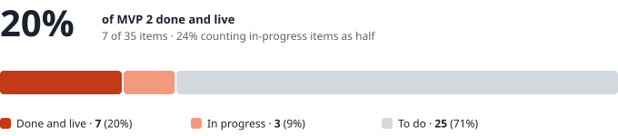
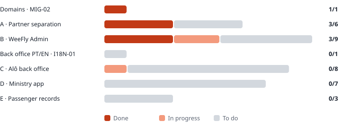

# WeeFly · MVP 2 · Status on 30 September

| | |
|---|---|
| **To** | Dominik · Ivandro |
| **From** | Fábio |
| **Date** | 30 September 2026 |
| **Basis** | `WeeFly_MVP2_Para_Developer.md` (30 September) · 35 items in 5 blocks |
| **Live** | `concierge.weefly.africa` · commit `06c4b44` · migration `0026` applied |

---

## Where we are

**The first delivery for testing is live**: steps 0 to 3 of the *Sequence*. It gives the WeeFly team Admin access and unlocks the Alô accounts.

In terms of effort, the real figure is lower than 20%. The three heaviest pieces have not started yet: the ministry budget (`PAR-03`), the ministry app (`MIN-01`) and the branding across every screen and email (`TEN-02`).

### By block

| Block | Done | In progress | To do | Total |
|---|---|---|---|---|
| Domains · `MIG-02` | 1 | 0 | 0 | 1 |
| A · Partner separation | 3 | 0 | 3 | 6 |
| B · WeeFly Admin | 3 | 2 | 4 | 9 |
| Back office PT/EN · `I18N-01` | 0 | 0 | 1 | 1 |
| C · Alô back office | 0 | 1 | 7 | 8 |
| D · Ministry app | 0 | 0 | 7 | 7 |
| E · Passenger records | 0 | 0 | 3 | 3 |
| **Total** | **7** | **3** | **25** | **35** |

---

## Done and live

| ID | What it does |
|---|---|
| `MIG-02` | Every link comes from the configured address, never from the address the back office was opened on. The server only answers on `concierge.weefly.africa`. The NGINX file that switches off `weefly.duckdns.org` is ready. |
| `TEN-01` | Partner → organisation → case. Every case has a partner; the organisation is optional. |
| `TEN-03` | The back office reads through the signed-in user's session, and the database decides what each account sees. A case from another partner opened by its direct address returns **not found**. The queue, search, notification bell, clients and seller picker all respect the same boundary. |
| `TEN-06` | Every account belongs to a partner, taken from the session. Permissions come from the profile stored in the data. Admin appears for any account with the *WeeFly Admin* profile, not only Dominik's. Login opens the Concierge. |
| `ADM-01` | *Admin › Partners*: create a partner (which creates its first administrator and sends the invitation), configure its details and branding, suspend without deleting. Suspension blocks login and freezes the partner's links. |
| `ADM-02` | *Admin › Users and permissions*, and *Agent › Team* for the partner admin. The five fixed profiles. Create, edit, suspend and reactivate; nothing is deleted. Suspending ends open sessions. Every change is logged with author, date, before and after. A partner admin cannot grant the WeeFly Admin profile — refused by the database, not only by the screen. |
| `ADM-09` | Admilson (`admilsonborges@bonako.com`) has the WeeFly Admin profile. |

### In progress

| ID | What is left |
|---|---|
| `ADM-05` | Future modules already show as locked with *Coming soon* (from `PRO-03`/`PRO-04`). To be confirmed in testing. |
| `ADM-07` | The commission field already exists on the case, empty. Nothing is calculated until decisions C1, D1, D7 and D8. |
| `PAR-01` | Login already opens the Concierge. To be confirmed with a real Alô account. |

### Proven before deployment

- Migration `0026` ran on a test Postgres, twice in a row, together with the 25 before it.
- The isolation tests run the way Supabase runs: one account per partner, every table, reads and writes. They include B4 (a partner admin cannot grant WeeFly Admin), B5 (suspension cuts access on the next request) and B6 (the change log).
- An independent code review looking for leaks between partners found three issues, fixed before deployment.

---

## To close the first delivery

| # | What | Who |
|---|---|---|
| 1 | Run the **Block A** tests (A1–A9) and **Block B** tests (B1–B6). *"If one fails, no real Alô account is opened."* The steps are in `docs/mvp2-entrega-1.md`. | Admilson · Dominik |
| 2 | Send Admilson his invitation: *Admin › Users and permissions* › *Resend invitation*. | Dominik or Fábio |
| 3 | Install `deploy/nginx/weefly-duckdns-off.conf` and switch off the DuckDNS updater. The old address must stop answering. | Fábio |
| 4 | Close port 22 on the server. It is open to the whole internet; access already goes through Session Manager. | Sarin |

A10 (`alo.weefly.africa/m/nao-existe`) and A6 (export) cannot be tested yet: the first depends on DNS (`TEN-04`), the second on `ADM-03`.

---

## Decisions needed

In order of urgency: the first ones hold up the work of the coming weeks.

| # | Question | Who decides | Blocks | Needed by |
|---|---|---|---|---|
| **S1** | Approve the scope change: `ADM-02` and `ADM-08` are part of MVP 2. `ADM-02` is already done. | Ivandro · Dominik | MVP 2 dates | Now |
| **O3** | Does ministry management sit inside **Client** or in its own **Ministries** menu? | Ivandro | `PAR-02` (step 5) | Before step 5 |
| **O4** | Does the secretary sign in **with the link only**, or with **link and password**? | Ivandro | `MIN-01` (step 6) | Before step 6 |
| **O1** | Who at Alô and at WeeFly receives the balance alerts? | Alô · Dominik | `PAR-05` · `ADM-06` | Before step 5 |
| **O2** | Does the ministry see its own balance, or only Alô? | Dominik · Alô | `PAR-03` | Before step 5 |
| **D9** | When a traveller does not fly, what happens to the amount already deducted from the budget? Until then: manual credit with a reason. | Contract with Alô | `PAR-03` | Before launch |
| **C1** | Are commissions calculated in the system (v5.2) or outside it (decision of 26 September)? | Ivandro · Dominik | `ADM-07` · `PAR-08` | Before step 7 |
| **D1** | Is the per-issuance percentage on cost or on the amount charged to the ministry? | Dominik (with Alô) | `ADM-07` | Before step 8 |
| **D7** | Is the per-account fee charged once or every month? | Dominik | `ADM-07` | Before step 8 |
| **D8** | Is the commission different for an official reseller and a white label? | Dominik | `ADM-07` | Before step 8 |
| **L1** | Legal basis for storing passports and contact details of government staff. | Legal | `DAT-03` | Before launch |
| **L2** | Retention period for that data. | Legal | `DAT-03` | Before launch |
| **L3** | Must the data be hosted in Cape Verde? The server is in Ireland (AWS). | Legal | Infrastructure | **As soon as possible** — if the answer is yes, it changes where everything runs |
| **L-03** | Dutch: the text for "no baggage" is missing. | Dominik | NL dictionary | When possible |

---

## What needs to be requested

### From Alô — to set up the partner (`ADM-01`, `TEN-02`, `MIN-04`)

| Item | Status |
|---|---|
| Trading name | ✅ Alô Cabo Verde Tour |
| PNG logo | ✅ Received |
| Primary and accent colours | ✅ From the logo |
| **Vector logo** (SVG or PDF) | ❌ The PNG has jagged edges |
| **Compact logo** (the globe only) | ❌ For mobile, the app icon and the favicon |
| Dark colour — confirm `#0078E8` | ❌ |
| Legal name, tax number (NIF), address | ❌ |
| Contact person, email, phone | ❌ |
| Email sender name and address (e.g. `reservas@…`) | ❌ |
| Reply-to address | ❌ |
| Footer text | ❌ |
| Support WhatsApp number | ❌ |
| Does the link show the Alô screen or the WeeFly screen? | ❌ Assumed Alô |
| Contract start date | ❌ |
| **Email of Alô's first administrator** | ❌ The person who receives the invitation when the partner is created |

### For testing — a test ministry

Name, address identifier (e.g. `teste`), coat of arms, name and contact details of the test secretary, opening balance and alert threshold.

### From Sarin — infrastructure

| Request | Why |
|---|---|
| DNS record `*.weefly.africa` pointing to the server | `TEN-04` · `alo.weefly.africa` |
| **Wildcard** certificate for `*.weefly.africa` | `TEN-04` · one certificate for every partner |
| Close port 22 | Security · access already goes through Session Manager |

### Resend (Fábio)

Verify Alô's sending domain once they say which one it is. Without it, Alô's emails cannot go out under its own sender (`TEN-02`).

---

## Next steps

| Step | Items | Depends on |
|---|---|---|
| **4** | `TEN-02` branding · `TEN-04` addresses · `TEN-05` Powered by WeeFly · `I18N-01` back office PT/EN | DNS and certificate (Sarin) · Alô's details |
| **5** | `PAR-01` to `PAR-05` · `ADM-08` B2G area · `ADM-06` | O3 · O1 · O2 |
| **6** | `MIN-01` to `MIN-07` · the ministry app | O4 · test ministry |
| **7** | `PAR-06` to `PAR-08` · quoting, external payment, finance | C1 |
| **8** | `ADM-03`, `ADM-04`, `ADM-07` · figures and revenue | D1 · D7 · D8 |
| **9** | `DAT-01` to `DAT-03` · passenger records | L1 · L2 · L3 |

### What moves now, without waiting

Everything that belongs to the platform and does not depend on an external decision or piece of data starts now, in the order of the *Sequence*. The decisions slot in later without redoing the work.

| Item | How it moves without the decision |
|---|---|
| `TEN-02` · `TEN-05` · `I18N-01` | In full. Branding reads whatever is filled in on the partner; Alô's missing details go in through the screen, with no code. |
| `TEN-04` | Subdomain routing is built and tested; it switches on the day the DNS and certificate exist. |
| `PAR-02` | Built in its own menu. If **O3** says *inside Client*, only the menu position changes. |
| `PAR-03` · `PAR-04` | In full: balance, movements, deduction at issuance, blocking. **O2** is a switch (the secretary sees the balance or not), and **D9** stays as a manual credit with a reason, as the document asks. |
| `PAR-05` · `ADM-06` | The alert engine and the recipients screen. **O1** is just filling in who receives them. |
| `ADM-08` · `ADM-04` · `ADM-03` | In full, read-only. |
| `MIN-01` to `MIN-07` | The whole app. The secretary's sign-in (**O4**) is left to connect: nothing else depends on it. |
| `PAR-06` · `PAR-07` · `PAR-08` | In full, without the commission column (**C1**). |
| `DAT-01` · `DAT-02` | In full. |

**On hold until there is an answer:** the commission calculation (`ADM-07`, and the commission in `PAR-08`) and data retention (`DAT-03`). And no link is sent to a real ministry before L1, L2 and L3.
