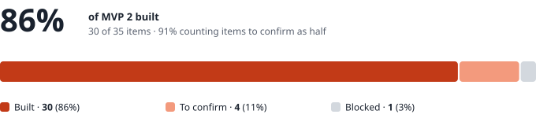
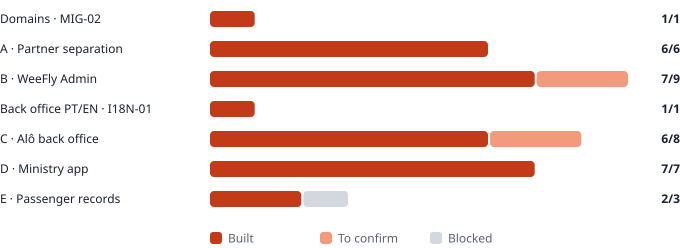

# WeeFly · MVP 2 · Status at the end of 30 September

| | |
|---|---|
| **To** | Dominik · Ivandro · Admilson |
| **From** | Fábio |
| **Date** | 30 September 2026, end of day |
| **Basis** | `WeeFly_MVP2_Para_Developer.md` (30 September) · 35 items in 5 blocks |
| **Code** | `main` · commit `f0aac44` · migrations `0026` to `0030` applied |
| **Live** | `concierge.weefly.africa` still runs `06c4b44` (the first delivery). Deploying `f0aac44` is still to do |

Replaces the status from the morning of the same day.

---

## Where we are

**Everything that does not depend on a decision is built**: steps 0 to 9 of the *Sequence*, except two things the brief itself says to hold — the commission calculation (`ADM-07`) and data retention (`DAT-03`).

"Built" means: the code is on `main`, it compiles, and the database has the tables. **It does not yet mean tested end to end, nor live.** The Block A, B and D tests are still to run, and so is the deploy (see *Going live*).

### By block

| Block | Built | To confirm | Blocked | Total |
|---|---|---|---|---|
| Domains · `MIG-02` | 1 | 0 | 0 | 1 |
| A · Partner separation | 6 | 0 | 0 | 6 |
| B · WeeFly Admin | 7 | 2 | 0 | 9 |
| Back office PT/EN · `I18N-01` | 1 | 0 | 0 | 1 |
| C · Alô back office | 6 | 2 | 0 | 8 |
| D · Ministry app | 7 | 0 | 0 | 7 |
| E · Passenger records | 2 | 0 | 1 | 3 |
| **Total** | **30** | **4** | **1** | **35** |

**To confirm:**

- `ADM-05` (future modules shown as *Coming soon*): comes from `PRO-03`/`PRO-04`, still to be seen in the test.
- `ADM-07`: the fields are on the case and show in the numbers, but the calculation waits for C1.
- `PAR-01` (opens in Concierge): needs a real Alô account.
- `PAR-06` (quote and offer): it is the existing engine, with the case under the right partner; needs a real Alô case.

**Blocked:** `DAT-03`, until L1, L2 and L3 are answered.

---

## What has been built since the first delivery

### Step 4 · branding, addresses and two languages (`6721b4d`)

| ID | What it does |
|---|---|
| `TEN-02` | The partner's brand — logo, ministry crest, colours, sender, reply-to and footer — in `/pc` and in client emails. No colour is hard-coded: WeeFly is a partner too, with its colours in the data (`0027`). |
| `TEN-04` | The partner from the subdomain (`alo.weefly.africa`), ready for DNS. An unknown subdomain returns 404. |
| `TEN-05` | *Powered by WeeFly* in the partner back office and in Admin. |
| `I18N-01` | Back office in Portuguese and English, chosen in *Settings* and stored on the account. What goes to the client stays in the case's language. |

### Step 5 · Alô back office and the budget (`5d6e45a`)

| ID | What it does |
|---|---|
| `PAR-02` | *Agent › Ministries*: create, edit, and the ministry's single link, which can be regenerated. |
| `PAR-03` | The budget is the sum of append-only movements. Credit with the document reference. A debit locks the row and refuses when funds are short — two agents at once cannot both get through. |
| `PAR-04` | Secretary change: the old account is suspended and a new link goes out. |
| `PAR-05` · `ADM-06` | Balance alerts once a day, by email and WhatsApp, to the configured recipients. |
| `PAR-07` | *Confirm external payment* on the case: records it, debits the budget and releases issuance. Reversing restores the balance. |
| `ADM-08` | *Admin › B2G*: every ministry of every partner, read only; correcting a balance asks for a reason and is recorded. |

### Step 6 · the ministry app

| ID | What it does |
|---|---|
| `MIN-01` | `/m/<ministry>/<link>`: a fixed bottom bar with *New request* (opens first) and *My tickets* (the active trip on top, the archive below, only that ministry's). The bar stays on the case screens. The requester is already known, so the contact step is skipped. |
| `MIN-02` | Alô logo and the ministry crest in the header. |
| `MIN-03` | Phone and email per passenger, marked *operational support only* with the sentence explaining why (`0029`). Warning when the passport has less than six months after return. Typing a name that has travelled with the ministry offers to reuse the record. |
| `MIN-04` | Alô's WhatsApp, with the ministry name and reference pre-filled, on every screen. |
| `MIN-05` | Welcome email with Alô branding, the link and per-platform instructions (from step 5). |
| `MIN-06` | Install as an app: a manifest per ministry, Android in one tap, iPhone in three steps. |
| `MIN-07` | The offer shows its deadline from the time it was sent. A ministry has no payment screen: the secretary reads that there is nothing to pay on her side. The case appears to Alô as *Ready to issue*. If the balance does not cover it, the secretary sees so and Alô is alerted in the bell. |

> **Why accepting does not issue on its own.** `PAR-07` says it is *confirming the external payment* that debits the budget and releases issuance, and `0028` was built that way. So after the secretary accepts, the case sits in Alô's queue with the alert *Ready to issue · confirm the external payment*. That is one click for the agent, and nothing is asked of the secretary. If you want the debit to happen automatically the moment the secretary accepts, it is a small change — but it is a decision, not a detail.

### Steps 7 to 9 · finance, numbers, cases and records

| ID | What it does |
|---|---|
| `PAR-08` | *Agent › Finance*, for the partner admin. Per ticket: cost, amount charged, commission, issue date and who issued it. Per ministry: issued, spent from the budget, and balance. CSV export. |
| `ADM-03` | *Admin › Numbers*: tickets by partner and by ministry, unit and total cost, the timeline, who issued. Filters: today, week, month, year, range, and by partner. CSV. **It is the same query as `PAR-08`** — the numbers match by construction, not by coincidence. |
| `ADM-07` | The commission column is on the case and shows in `PAR-08`, `ADM-03` and the CSV — empty. Nothing is calculated. |
| `ADM-04` | *Admin › Cases*: partner, then ministry, then the case, read only. To change another partner's case there is *Intervene*: it asks for a reason, gives four hours, and is recorded twice — in the interventions table (only Admin sees it) and in the case history, which the partner sees. While it lasts, the case shows a banner with *End intervention*. |
| `DAT-01` | Records belong to the ministry. They are created when the secretary saves the passengers; `0030` also created them for existing cases. Editable in Alô's back office, with the history of every change — who, when, from where, before and after. The history is written by the database and cannot be altered. |
| `DAT-02` | A stored passport with less than six months to expiry: an email to the secretary, once per expiry date, in the same daily cron as the balance alerts. In the back office the record is flagged ⚠, and the ministry shows how many there are. |

### Database

Migrations `0026` to `0030` are applied. Confirmed with `node scripts/check-migrations.mjs`: *All applied*.

Partner-isolation tests exist for every block: `test_tenancy`, `test_rbac`, `test_b2g` and, new, `test_travellers`. The new one tests that the history cannot be altered, that a passport is unique per ministry, that Beta cannot see Alô's records, and that only Admin reads interventions. **`test_travellers` has not run yet**: it needs Docker Desktop (`bash supabase/tests/run.sh`).

---

## Going live

| # | What | Who |
|---|---|---|
| 1 | Deploy `f0aac44` on EC2 (`git pull`, build, restart), as in `docs/deploy-ec2.md`. | Fábio · Sarin |
| 2 | Confirm `PC_CRON_TOKEN` is in the environment and enable the timer: `sudo cp deploy/systemd/weefly-b2g-alerts.* /etc/systemd/system/` and `sudo systemctl enable --now weefly-b2g-alerts.timer`. Without it, neither balance nor passport alerts go out. | Sarin |
| 3 | Install `deploy/nginx/weefly-duckdns-off.conf` and switch off the DuckDNS updater (from the first delivery, still pending). | Fábio |
| 4 | Close port 22. | Sarin |

---

## Tests to run

*"If one fails, no real Alô account is opened."*

| Block | Where | What it proves |
|---|---|---|
| **A** (A1–A10) · **B** (B1–B6) | `docs/mvp2-entrega-1.md` | Partner separation, roles, WeeFly Admin. A6 (export) can now be tested: it is the `ADM-03` CSV. A10 still depends on DNS. |
| **D** (D1–D8) | Admilson's brief, *Block D test* | From the secretary's request to the issued ticket, with the *Test Ministry*. In D3, "goes straight to issuance" is the agent confirming the external payment (see the `MIN-07` note). |
| Finance | *Agent › Finance* and *Admin › Numbers* | Issue two test tickets, one for a ministry. The partner's and Admin's figures must be the same, and the CSV the same as the screen. |
| Intervention | *Admin › Cases* | Open an Alô case with a WeeFly Admin account: read only. *Intervene* with a reason: it opens in Concierge, and the reason shows in the case history for Alô. |
| Records | *Agent › Ministries › ministry* | A passenger whose passport expires in 4 months: ⚠ in the list. Edit the record: the change appears in the history. |

---

## Decisions needed

| # | Question | Who decides | How it is built until there is an answer |
|---|---|---|---|
| **C1** | Are commissions calculated in the system or outside it? | Ivandro · Dominik | Empty column everywhere. |
| **D1** | Is the percentage on cost or on the amount charged? | Dominik (with Alô) | — |
| **D7** | Is the per-account fee one-off or monthly? | Dominik | — |
| **D8** | Different commission for official reseller vs white label? | Dominik | — |
| **L1** · **L2** | Legal basis and retention period for passports and contact details. | Legal | Nothing is deleted or anonymised. **No link goes to a real ministry before this.** |
| **L3** | Must the data be hosted in Cape Verde? The server is in Ireland. | Legal | **As soon as possible** — if yes, it changes where everything runs. |
| **O4** | Does the secretary sign in with the link only, or link and password? | Ivandro | Link only. A password can be added in one place without touching the rest. |
| **O3** | Ministries inside *Client*, or their own menu? | Ivandro | Own menu. Changing it means changing the menu. |
| **O1** | Who receives the balance alerts? | Alô · Dominik | Nobody until filled in on the recipients screen. The alert is still recorded. |
| **O2** | Does the ministry see its own balance? | Dominik · Alô | No, by default. It is a switch per ministry. |
| **D9** | A traveller who does not fly: what happens to the amount already debited? | Contract with Alô | Manual credit with a reason. |
| **MIN-07** | Does accepting the offer debit the budget by itself, or does the agent's click stay? | Ivandro · Dominik | The agent's click (see the note above). |
| **S1** | Approve `ADM-02` and `ADM-08` in the MVP 2 scope. | Ivandro · Dominik | Both are done. |

---

## What we need to ask for

**From Alô:** the logo in vector format and the compact version (installed app icon and favicon), the dark colour, legal name, tax number and address, the contact person, the email sender and reply-to address, the footer text, the **support WhatsApp number**, the start date, and the **email of the first administrator**.

**For the tests:** the *Test Ministry* — name, address identifier, crest, the test secretary with contact details, starting balance and alert threshold.

**From Sarin:** DNS `*.weefly.africa` and a wildcard certificate (`TEN-04`), the alerts timer, and port 22.

**Resend (Fábio):** verify Alô's sending domain as soon as she says which one it is.

---

## Next steps

1. Deploy `f0aac44` and enable the alerts timer.
2. Block A, B and D tests, plus the finance, intervention and records ones.
3. With the answers: C1, D1, D7 and D8 switch on the commission calculation (`ADM-07`, and the column in `PAR-08`/`ADM-03`); L1 to L3 close `DAT-03`; O4 closes the secretary sign-in.
